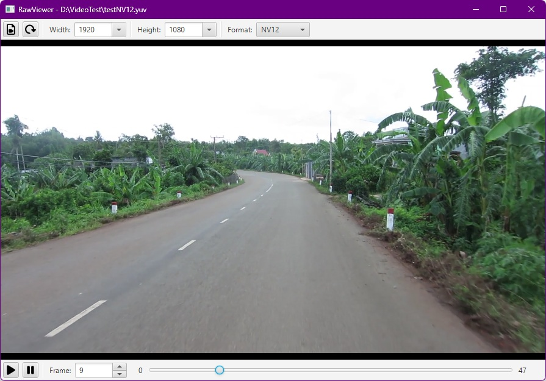
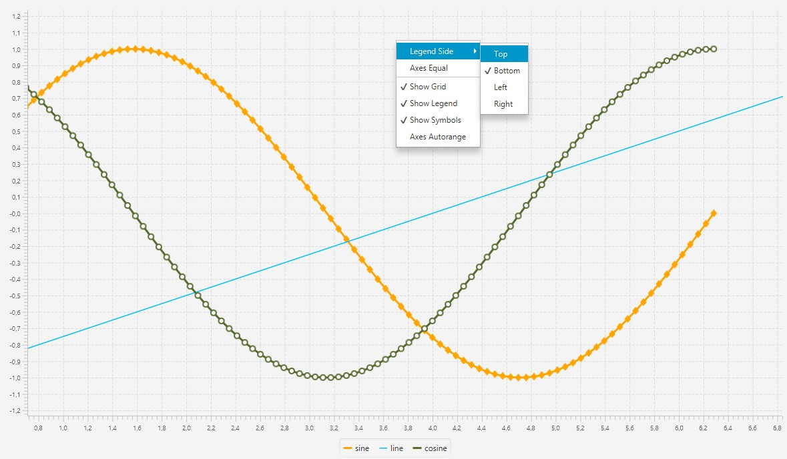
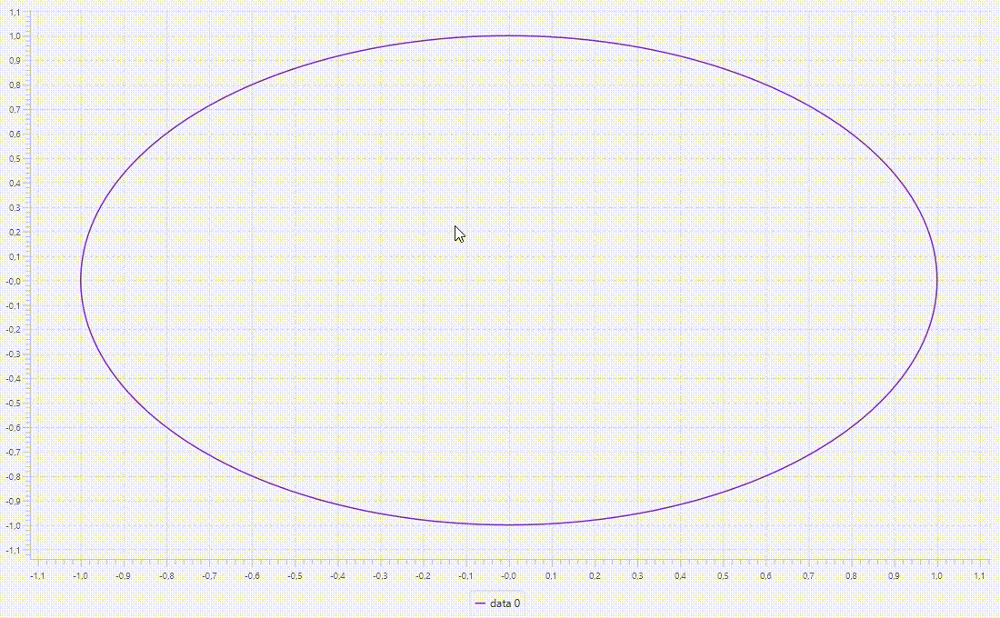

# Utilities written in Java and JavaFX

Small projects only using Standard Java and JavaFX. All code is contained in one single source file.

## RawViewer

Open and play video files stored in raw file formats like YUV444P, NV12, BGR24, etc.



## FFmpegFrame

Simple interface between Java and FFMPEG to read and write individual frames via the ```image2pipe``` feature of ffmpeg. 

Example to read frames from video input into Java BufferedImages
```
//create a reader builder
FFmpegFrame reader = FFmpegFrame.readerBuilder()

    //set path to the ffmpeg executable, may just be 'ffmpeg' if that executable is on the system path
    .setFFmpegPath(ffmpegPath)
    
    //set the video input
    .setInputFile(videoFile)
    
    .build();

//now in a loop grab frames, return value will be null when no image can be read
BufferedImage image = reader.readFrame();
```

Example to put images into a video
```
//create a writer builder
FFmpegFrame writer = FFmpegFrame.writerBuilder()

    //set path to the ffmpeg executable, may just be 'ffmpeg' if that executable is on the system path
    .setFFmpegPath(ffmpegPath)
    
    //set the video output
    .setOutputFile(outputPath)

    //optionally set video codec, video pixel format, frame rate

    .build();

//now in a loop send BufferedImages to the writer
BufferedImage image = ...
writer.writeFrame(image);

//close the writer to make ffmpeg flush its buffer
String ffmpegConsoleOutput = writer.close();
```

Check the ffmpeg console output via ```getOutput()``` any time for hints in case of unexpected behaviour

## DataPlotter

InteractiveLineChart is an extension to LineChart which makes the chart behave like a map that can be zoomed and panned to inspect data points in close detail.

Main Features
- drag the chart area to adjust the visible range for both axes
- scroll the mouse wheel on the chart area to zoom in and out on both axes
- place the mouse on one individual axis to adjust only that specific axis

Use the SeriesBuilder subclass via ```seriesBuilder()``` to conveniently add data

Use right click context menu on the chart area to
- set axes to equal data intervals
- enable or disable axes auto ranging
- show or hide symbols on data points
- and more

Have a look at the Demo Application



